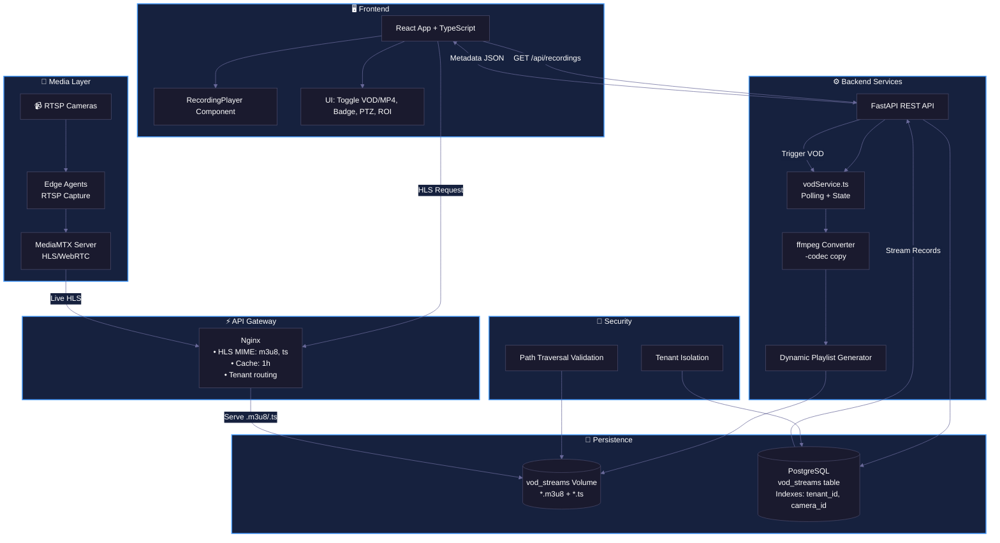
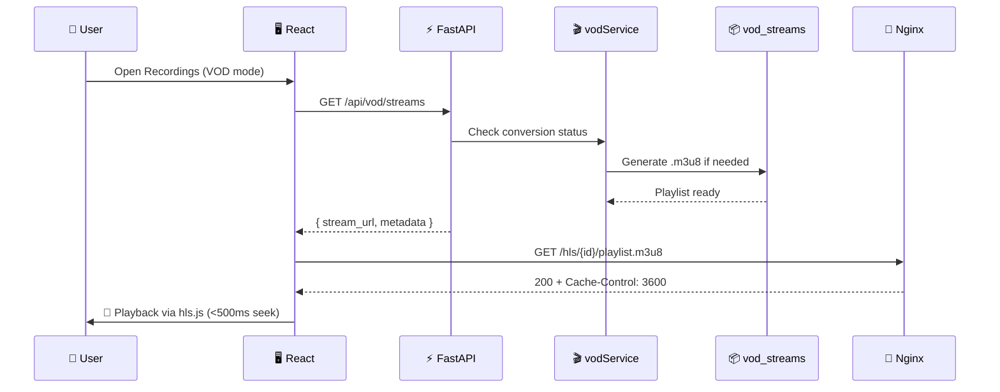

# VMS MVP - Architecture Diagram

## Sequence: VOD Playback Flow

## Component Details

| Component | Technology | Responsibility |
|-----------|-----------|----------------|
| **React Frontend** | React 18 + TypeScript + hls.js | UI, VOD/MP4 toggle, player controls |
| **Nginx Gateway** | Nginx | HLS serving, caching, tenant routing, MIME types |
| **FastAPI** | Python 3.11 + FastAPI | REST API, business logic, tenant isolation |
| **vodService** | TypeScript | Polling, state management, conversion orchestration |
| **ffmpeg Converter** | ffmpeg | MP4→HLS conversion with `-codec copy` |
| **MediaMTX** | MediaMTX | Live HLS/WebRTC streaming, RTSP ingestion |
| **Edge Agents** | Go/Python | RTSP capture, segment upload, health checks |
| **PostgreSQL** | PostgreSQL 15 | Metadata storage, optimized indexes |
| **Docker Volume** | Docker | HLS artifact storage (*.m3u8, *.ts) |

## Data Flow Summary

1. 📹 Cameras stream RTSP → Edge Agents
2. 🔄 Edge Agents push segments → MediaMTX (live) / Storage (VOD)
3. ⚡ FastAPI exposes metadata via REST API
4. 🖥️ React fetches metadata + requests HLS via Nginx
5. 🎬 vodService orchestrates MP4→HLS conversion on-demand
6. 🔐 All requests validated for tenant isolation + path safety

---

> 💡 **View this diagram**:  
> - VS Code: Install "Mermaid Preview" extension  
> - Online: Paste at [mermaid.live](https://mermaid.live)  
> - GitHub/GitLab: Renders natively in `.md` files