# Diagrama Entidade-Relacionamento (DER)

> Representa todas as entidades persistidas no PostgreSQL, seus atributos-chave e os relacionamentos entre elas.

---

## Diagrama Completo (Mermaid ER)

```mermaid
erDiagram

    %% ─── IAM ───────────────────────────────────────────────────────────────────
    tenants {
        UUID   id PK
        string name
        string slug UK
        bool   is_active
        bool   facial_recognition_enabled
        ts     facial_recognition_consent_at
        UUID   license_key_id FK
        bool   onboarding_complete
        string company_name
        string cnpj
        string logo_url
        ts     created_at
    }

    users {
        UUID   id PK
        UUID   tenant_id FK
        string email
        string hashed_password
        string full_name
        string role
        bool   is_active
        ts     created_at
    }

    api_keys {
        UUID   id PK
        UUID   tenant_id FK
        string owner_type
        UUID   owner_id
        string key_hash
        string prefix
        bool   is_active
        ts     last_used_at
        ts     created_at
    }

    %% ─── CAMERAS & AGENTS ───────────────────────────────────────────────────────
    agents {
        UUID   id PK
        UUID   tenant_id FK
        string name
        string status
        ts     last_heartbeat_at
        string version
        int    streams_running
        int    streams_failed
        ts     created_at
    }

    cameras {
        UUID   id PK
        UUID   tenant_id FK
        UUID   agent_id FK
        string name
        string location
        float  latitude
        float  longitude
        bool   ia_enabled
        string stream_protocol
        string rtsp_url
        string rtmp_stream_key UK
        string manufacturer
        int    retention_days
        string stream_quality
        bool   is_active
        bool   is_online
        bool   isapi_enabled
        string isapi_base_url
        string serial_number
        jsonb  isapi_capabilities
        ts     created_at
    }

    %% ─── EVENTS ─────────────────────────────────────────────────────────────────
    vms_events {
        UUID   id PK
        UUID   tenant_id FK
        UUID   camera_id FK
        string event_type
        string plate
        float  confidence
        jsonb  payload
        ts     occurred_at
    }

    %% ─── RECORDINGS ─────────────────────────────────────────────────────────────
    recording_segments {
        UUID   id PK
        UUID   tenant_id FK
        UUID   camera_id FK
        string mediamtx_path
        string file_path
        ts     started_at
        ts     ended_at
        float  duration_seconds
        int    size_bytes
        string sha256_hash
        ts     integrity_verified_at
        jsonb  custody_chain
        ts     created_at
    }

    clips {
        UUID   id PK
        UUID   tenant_id FK
        UUID   camera_id FK
        ts     starts_at
        ts     ends_at
        string status
        string file_path
        UUID   vms_event_id FK
        ts     created_at
    }

    %% ─── STREAMING ──────────────────────────────────────────────────────────────
    stream_sessions {
        UUID   id PK
        UUID   tenant_id FK
        UUID   camera_id FK
        string mediamtx_path
        ts     started_at
        ts     ended_at
    }

    %% ─── ANALYTICS ──────────────────────────────────────────────────────────────
    plugin_installations {
        UUID   id PK
        string plugin_id
        string plugin_name
        string version
        string edge_agent_id
        UUID   tenant_id FK
        string status
        jsonb  settings
        string model_path
        int    fps_target
        ts     created_at
        ts     updated_at
    }

    analytics_events {
        UUID   id PK
        UUID   plugin_installation_id FK
        UUID   tenant_id FK
        string camera_id
        string plugin_id
        string event_type
        string severity
        float  confidence
        jsonb  payload
        string snapshot_path
        ts     occurred_at
    }

    analytics_rois {
        UUID   id PK
        UUID   tenant_id FK
        string camera_id
        string plugin_id
        string name
        jsonb  polygon
        jsonb  config
        bool   is_active
        ts     created_at
        ts     updated_at
    }

    %% ─── NOTIFICATIONS ───────────────────────────────────────────────────────────
    notification_rules {
        UUID   id PK
        UUID   tenant_id FK
        string name
        string event_type_pattern
        string destination_url
        string webhook_secret
        bool   is_active
        ts     created_at
    }

    notification_logs {
        UUID   id PK
        UUID   tenant_id FK
        UUID   rule_id FK
        UUID   vms_event_id FK
        string status
        int    response_code
        text   response_body
        int    attempt
        ts     dispatched_at
    }

    %% ─── AUDIT ───────────────────────────────────────────────────────────────────
    audit_logs {
        UUID   id PK
        UUID   tenant_id FK
        UUID   user_id
        string user_email
        string user_role
        string action
        string resource_type
        UUID   resource_id
        string ip_address
        text   user_agent
        jsonb  payload
        string result
        ts     occurred_at
    }

    %% ─── BILLING & LICENSING ─────────────────────────────────────────────────────
    license_keys {
        UUID    id PK
        string  license_key UK
        UUID    tenant_id
        string  deployment_model
        string  status
        int     max_cameras
        decimal price_annual
        string  hardware_id
        ts      activated_at
        ts      expires_at
        ts      created_at
    }

    analytics_pricing {
        UUID    id PK
        string  plugin_name UK
        string  tier
        decimal price_per_camera_per_day
        text    description
        bool    is_active
        ts      created_at
    }

    licenses {
        UUID   id PK
        UUID   tenant_id FK
        string camera_id
        string license_type
        string status
        int    storage_limit_gb
        bool   analytics_enabled
        ts     activated_at
        ts     expires_at
        ts     created_at
    }

    %% ─── REPORTS ─────────────────────────────────────────────────────────────────
    reports {
        UUID   id PK
        UUID   tenant_id FK
        string report_type
        jsonb  parameters
        string status
        string file_path
        string sha256_hash
        ts     scheduled_for
        ts     generated_at
        UUID   created_by
        ts     created_at
    }

    %% ─── LGPD ────────────────────────────────────────────────────────────────────
    retention_policies {
        UUID   id PK
        UUID   tenant_id FK
        string data_type
        int    retention_days
        bool   anonymize_instead_of_delete
        bool   auto_enabled
        ts     created_at
        ts     updated_at
    }

    consent_records {
        UUID   id PK
        UUID   tenant_id FK
        UUID   user_id
        string data_type
        string action
        string consent_text_hash
        string ip_address
        ts     created_at
    }

    %% ─── RELACIONAMENTOS ─────────────────────────────────────────────────────────
    tenants         ||--o{ users                  : "1:N"
    tenants         ||--o{ api_keys               : "1:N"
    tenants         ||--o{ agents                 : "1:N"
    tenants         ||--o{ cameras                : "1:N"
    tenants         ||--o{ vms_events             : "1:N"
    tenants         ||--o{ recording_segments     : "1:N"
    tenants         ||--o{ clips                  : "1:N"
    tenants         ||--o{ stream_sessions        : "1:N"
    tenants         ||--o{ notification_rules     : "1:N"
    tenants         ||--o{ notification_logs      : "1:N"
    tenants         ||--o{ plugin_installations   : "1:N"
    tenants         ||--o{ reports                : "1:N"
    tenants         ||--o{ retention_policies     : "1:N"
    tenants         ||--o{ consent_records        : "1:N"
    tenants         ||--o{ licenses               : "1:N"
    tenants         }o--o| license_keys           : "ativa"

    agents          ||--o{ cameras                : "1:N"

    cameras         ||--o{ vms_events             : "1:N SET NULL"
    cameras         ||--o{ recording_segments     : "1:N CASCADE"
    cameras         ||--o{ clips                  : "1:N CASCADE"
    cameras         ||--o{ stream_sessions        : "1:N CASCADE"

    vms_events      ||--o{ notification_logs      : "1:N"
    vms_events      ||--o| clips                  : "opcional"

    notification_rules ||--o{ notification_logs   : "1:N"

    plugin_installations ||--o{ analytics_events  : "1:N SET NULL"
```

---

## Cardinalidades Resumidas

| Origem | Destino | Tipo | On Delete |
|--------|---------|------|-----------|
| `tenants` → `users` | 1:N | obrigatório | CASCADE |
| `tenants` → `api_keys` | 1:N | obrigatório | CASCADE |
| `tenants` → `agents` | 1:N | obrigatório | CASCADE |
| `tenants` → `cameras` | 1:N | obrigatório | CASCADE |
| `tenants` → `vms_events` | 1:N | obrigatório | CASCADE |
| `tenants` → `recording_segments` | 1:N | obrigatório | CASCADE |
| `tenants` → `clips` | 1:N | obrigatório | CASCADE |
| `tenants` → `stream_sessions` | 1:N | obrigatório | CASCADE |
| `tenants` → `notification_rules` | 1:N | obrigatório | CASCADE |
| `tenants` → `notification_logs` | 1:N | obrigatório | CASCADE |
| `tenants` → `plugin_installations` | 1:N | obrigatório | CASCADE |
| `tenants` → `reports` | 1:N | obrigatório | CASCADE |
| `tenants` → `retention_policies` | 1:N | obrigatório | CASCADE |
| `tenants` → `consent_records` | 1:N | obrigatório | CASCADE |
| `tenants` → `licenses` | 1:N | obrigatório | CASCADE |
| `tenants` ↔ `license_keys` | 1:1 | opcional (ativa) | SET NULL |
| `agents` → `cameras` | 1:N | opcional | SET NULL |
| `cameras` → `vms_events` | 1:N | opcional | SET NULL |
| `cameras` → `recording_segments` | 1:N | obrigatório | CASCADE |
| `cameras` → `clips` | 1:N | obrigatório | CASCADE |
| `cameras` → `stream_sessions` | 1:N | obrigatório | CASCADE |
| `vms_events` → `notification_logs` | 1:N | obrigatório | CASCADE |
| `vms_events` ↔ `clips` | 1:1 | opcional | SET NULL |
| `notification_rules` → `notification_logs` | 1:N | obrigatório | CASCADE |
| `plugin_installations` → `analytics_events` | 1:N | opcional | SET NULL |

---

## Contextos Bounded Context × Tabelas

| Bounded Context | Tabelas |
|----------------|---------|
| **IAM** | `tenants`, `users`, `api_keys` |
| **Cameras & Agents** | `agents`, `cameras` |
| **Events** | `vms_events` |
| **Recordings** | `recording_segments`, `clips` |
| **Streaming** | `stream_sessions` |
| **Notifications** | `notification_rules`, `notification_logs` |
| **Analytics** | `plugin_installations`, `analytics_events`, `analytics_rois` |
| **Audit** | `audit_logs` |
| **Billing** | `license_keys`, `analytics_pricing`, `licenses` |
| **Reports** | `reports` |
| **LGPD** | `retention_policies`, `consent_records` |
